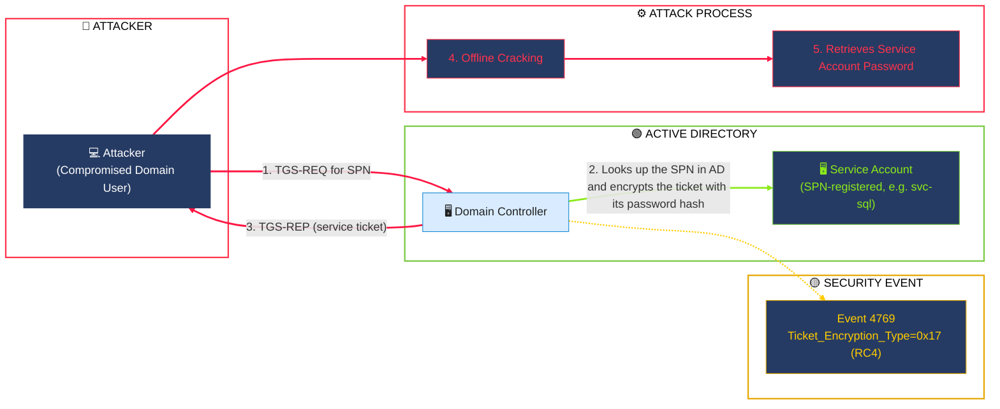

```mermaid
graph LR;

    subgraph ATTACKER["🔴 ATTACKER"]
        A["💻 Attacker<br/>(Compromised Domain User)"]
    end

    subgraph DOMAIN["🟢 ACTIVE DIRECTORY"]
        DC["🖥️ Domain Controller"]
        SVC["🖥️ Service Account<br/>(SPN-registered, e.g. svc-sql)"]
    end

    subgraph MONITORING["🟡 SECURITY EVENT"]
        E["Event 4769<br/>Ticket_Encryption_Type=0x17 (RC4)"]
    end

    subgraph PROCESS["⚙️ ATTACK PROCESS"]
        P4["4. Offline Cracking"]
        P5["5. Retrieves Service Account Password"]
    end

    %% AUTHENTICATION REQUEST
    A -->|"1. TGS-REQ for SPN"| DC

    %% SERVICE TICKET ENCRYPTION
    DC -->|"2. Looks up the SPN in AD and encrypts the ticket with its password hash"| SVC

    %% SECURITY EVENT LOGGING
    DC -.-> E

    %% SERVICE TICKET RESPONSE
    DC -->|"3. TGS-REP (service ticket)"| A

    %% OFFLINE CRACKING
    A --> P4
    P4 --> P5

    %% SUBGRAPH COLORS
    style ATTACKER fill:#ffffff,stroke:#ff334d,stroke-width:2px,color:#000
    style DOMAIN fill:#ffffff,stroke:#7ac943,stroke-width:2px,color:#000
    style MONITORING fill:#ffffff,stroke:#e6a700,stroke-width:2px,color:#000
    style PROCESS fill:#ffffff,stroke:#ff334d,stroke-width:2px,color:#000

    %% NODE COLORS
    style A fill:#263b63,color:#ffffff,stroke:#263b63
    style DC fill:#d9ecff,color:#222,stroke:#168bd2
    style SVC fill:#263b63,color:#8bea19,stroke:#7ac943
    style E fill:#263b63,color:#ffcc00,stroke:#e6a700
    style P4 fill:#263b63,color:#ff334d,stroke:#ff334d
    style P5 fill:#263b63,color:#ff334d,stroke:#ff334d

    %% EDGE COLORS
    %% TGS REQUEST / RESPONSE AND CRACKING - RED
    linkStyle 0,3,4,5 stroke:#ff1744,stroke-width:2.5px

    %% SERVICE ACCOUNT LOOKUP / ENCRYPTION - GREEN
    linkStyle 1 stroke:#8bea19,stroke-width:2.5px

    %% EVENT LOGGING - YELLOW
    linkStyle 2 stroke:#ffcc00,stroke-width:2px
```
